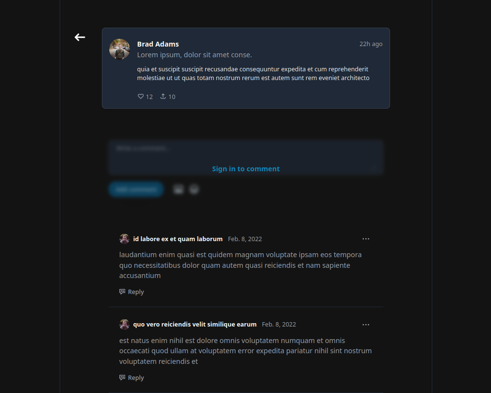

<div align="center">
	

<h1 align="center">Portfolio Manager Web</h1>
</div>

</br>

A lightweight, modern front-end for managing an assets portfolio (cryptocurrencies, tokens, stocks, etc.). The app provides a portfolio overview, transaction history, and forms to add or edit transactions. It integrates with backend services for authentication and data persistence.

## Table of Contents

- [Project Overview](#project-overview)
- [Key Features](#key-features)
- [Screenshots](#screenshots)
- [Architecture Notes](#architecture-notes)
- [Technologies](#technologies)
- [Prerequisites](#prerequisites)
- [Installation](#installation)
- [Running](#running)
- [Configuration](#configuration)
- [Key Files](#key-files)
- [Development & Testing](#development--testing)
- [Contributing](#contributing)
- [License](#license)

## Project Overview

This repository contains the front-end of a Portfolio Manager application built with Vite, React, and TypeScript. It consumes backend APIs (auth, tokens, transactions) to display current balances, token metadata, and transaction history.

The app is designed as a lightweight SPA with an emphasis on readable code and easy backend integration.

## Key Features

- Portfolio overview with aggregated values
- Asset list with search and filtering
- Asset detail view with live price display
- Add / edit transactions (buy, sell, transfer)
- Transaction history with sorting and pagination
- User authentication (login / signup)

## Screenshots




## Architecture Notes

- Components and pages are organized under `src/components` and `src/pages` respectively.
- Global state is managed via Redux Toolkit in `src/store`.
- API communication is implemented in `src/common/API/services`.
- Styling uses Tailwind CSS with SCSS for component-level styles.

Recommendations:

- Ensure the backend supports pagination and rate limiting for transaction lists.
- Implement client-side caching and background refresh for asset prices.
- Add integration tests for API service layers using mocked responses.

## Technologies

- Vite
- React + TypeScript
- Tailwind CSS, PostCSS, SCSS
- Redux Toolkit
- fetch / axios (in `src/common/API/services`)

## Prerequisites

- Node.js (LTS recommended)
- npm or yarn
- Running backend API (local or remote) for full integration

## Installation

```bash
git clone https://github.com/tejks/social-media-project
cd social-media-project
npm install
# or
yarn
```

## Running

Start in development mode (Vite):

```bash
npm run dev
```

Build for production and preview:

```bash
npm run build
npm run preview
```

## Configuration

Main configuration is located in `src/config/env.ts`.

Example `.env` variables:

```env
VITE_API_BASE_URL=https://api.example.com
VITE_NODE_ENV=development
```

Make sure the backend endpoints (auth, tokens, transactions) are reachable under `VITE_API_BASE_URL`.

## Key Files

- [src/main.tsx](src/main.tsx) — application entry point
- [src/index.scss](src/index.scss) — global styles
- [src/store](src/store) — Redux configuration
- [src/components](src/components) — UI components
- [src/pages](src/pages) — application pages
- [src/common/API/services](src/common/API/services) — API services (`auth.ts`, `photos.ts`, `post.ts`, `comment.ts`)

## Development & Testing

- Run linter and formatter before creating a PR if configured (`npm run lint`, `npm run format`).
- Add unit and integration tests for critical components and API services.

Common development commands:

```bash
npm run dev      # development server
npm run build    # production build
npm run preview  # preview production build
```

## Contributing

See [CONTRIBUTING.md](CONTRIBUTING.md) for contribution guidelines and PR preparation.

Short summary:

- Open issues for bugs or feature requests.
- Fork the repo, create a feature/fix branch, and submit a PR.
- Ensure the project builds locally before submitting a PR.

## License

This project is released under the MIT License — see the `LICENSE` file for details.
